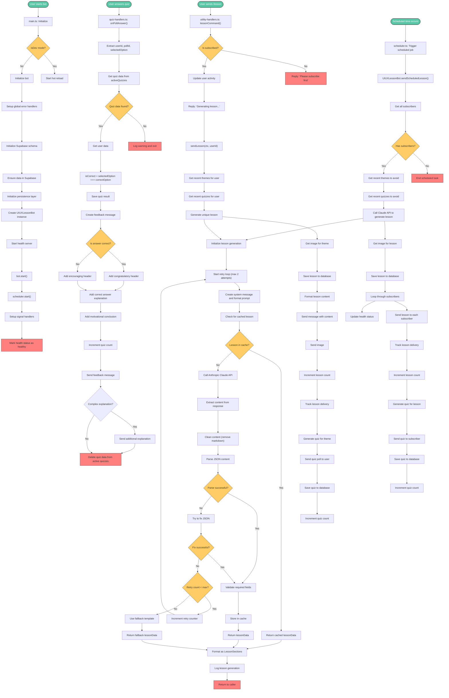

# UI/UX Bot Combined Flow Chart

```mermaid
flowchart TD
    %% Main entry points
    Start([User starts bot]) --> Main["main.ts: Initialize"]
    CommandLesson([User sends /lesson]) --> LessonCmd["utility-handlers.ts: lessonCommand()"]
    QuizAnswer([User answers quiz]) --> PollAns["quiz-handlers.ts: onPollAnswer()"]
    ScheduleTime([Scheduled time occurs]) --> SchedTask["scheduler.ts: Trigger scheduled job"]
    
    %% Bot initialization flow
    Main --> CheckDev{isDev mode?}
    CheckDev -->|Yes| HotReload["Start hot reload"]
    CheckDev -->|No| InitBot["Initialize bot"]
    
    InitBot --> GlobalErrors["Setup global error handlers"]
    GlobalErrors --> DBSchema["Initialize Supabase schema"]
    DBSchema --> EnsureData["Ensure data in Supabase"]
    EnsureData --> InitPersist["Initialize persistence layer"]
    InitPersist --> CreateBot["Create UIUXLessonBot instance"]
    CreateBot --> StartHealth["Start health server"]
    StartHealth --> BotStart["bot.start()"]
    BotStart --> SchedStart["scheduler.start()"]
    SchedStart --> SetupSignals["Setup signal handlers"]
    SetupSignals --> MarkHealthy["Mark health status as healthy"]
    
    %% Scheduled lesson flow
    SchedTask --> SendLesson["UIUXLessonBot.sendScheduledLesson()"]
    SendLesson --> GetSubs["Get all subscribers"]
    GetSubs --> CheckSubs{Has subscribers?}
    CheckSubs -->|No| EndScheduled["End scheduled task"]
    CheckSubs -->|Yes| GetThemes["Get recent themes to avoid"]
    GetThemes --> GetQuizzes["Get recent quizzes to avoid"]
    GetQuizzes --> GenerateLesson["Call Claude API to generate lesson"]
    GenerateLesson --> GetImage["Get image for lesson"]
    GetImage --> SaveLesson["Save lesson to database"]
    SaveLesson --> SendLoop["Loop through subscribers"]
    
    SendLoop --> SendToUser["Send lesson to each subscriber"]
    SendToUser --> TrackDelivery["Track lesson delivery"]
    TrackDelivery --> IncLessonCount["Increment lesson count"]
    IncLessonCount --> GenQuiz["Generate quiz for lesson"]
    GenQuiz --> SendQuiz["Send quiz to subscriber"]
    SendQuiz --> SaveQuiz["Save quiz to database"]
    SaveQuiz --> IncQuizCount["Increment quiz count"]
    SendLoop --> UpdateHealth["Update health status"]
    
    %% Manual lesson request flow
    LessonCmd --> CheckSubscribed{Is subscribed?}
    CheckSubscribed -->|No| ReplyNotSub["Reply: 'Please subscribe first'"]
    CheckSubscribed -->|Yes| UpdateActivity["Update user activity"]
    UpdateActivity --> ReplyWait["Reply: 'Generating lesson...'"]
    ReplyWait --> SendUserLesson["sendLesson(ctx, userId)"]
    
    SendUserLesson --> GetUserThemes["Get recent themes for user"]
    GetUserThemes --> GetUserQuizzes["Get recent quizzes for user"]
    GetUserQuizzes --> GenUserLesson["Generate unique lesson"]
    GenUserLesson --> GetUserImage["Get image for theme"] 
    GetUserImage --> SaveUserLesson["Save lesson to database"]
    SaveUserLesson --> FormatContent["Format lesson content"]
    FormatContent --> SendUserContent["Send message with content"]
    SendUserContent --> SendUserImage["Send image"]
    SendUserImage --> IncUserLessonCount["Increment lesson count"]
    IncUserLessonCount --> TrackUserDelivery["Track lesson delivery"]
    TrackUserDelivery --> GenUserQuiz["Generate quiz for theme"]
    GenUserQuiz --> SendUserQuiz["Send quiz poll to user"]
    SendUserQuiz --> SaveUserQuiz["Save quiz to database"]
    SaveUserQuiz --> IncUserQuizCount["Increment quiz count"]
    
    %% Quiz answer flow
    PollAns --> ExtractData["Extract userId, pollId, selectedOption"]
    ExtractData --> GetQuizData["Get quiz data from activeQuizzes"]
    GetQuizData --> CheckQuiz{Quiz data found?}
    CheckQuiz -->|No| LogWarning["Log warning and exit"]
    CheckQuiz -->|Yes| GetUser["Get user data"]
    GetUser --> CheckCorrect["isCorrect = selectedOption === correctOption"]
    CheckCorrect --> SaveResult["Save quiz result"]
    SaveResult --> CreateFeedback["Create feedback message"]
    
    CreateFeedback --> IsCorrectAns{Is answer correct?}
    IsCorrectAns -->|Yes| AddCongrats["Add congratulatory header"]
    IsCorrectAns -->|No| AddEncourage["Add encouraging header"]
    AddCongrats --> AddExplanation["Add correct answer explanation"]
    AddEncourage --> AddExplanation
    AddExplanation --> AddMotivation["Add motivational conclusion"]
    AddMotivation --> IncrementQuiz["Increment quiz count"]
    IncrementQuiz --> SendFeedback["Send feedback message"]
    SendFeedback --> CheckComplex{Complex explanation?}
    CheckComplex -->|Yes| SendExtra["Send additional explanation"]
    CheckComplex -->|No| CleanUp["Delete quiz data from active quizzes"]
    SendExtra --> CleanUp
    
    %% Lesson generation flow (Claude API)
    GenerateLesson --> InitLesson["Initialize lesson generation"]
    GenUserLesson --> InitLesson
    InitLesson --> RetryLoop["Start retry loop (max 2 attempts)"]
    RetryLoop --> CreatePrompt["Create system message and format prompt"]
    CreatePrompt --> CheckCache["Check for cached lesson"]
    
    CheckCache --> CacheHit{Lesson in cache?}
    CacheHit -->|Yes| ReturnCached["Return cached lessonData"]
    CacheHit -->|No| CallClaude["Call Anthropic Claude API"]
    CallClaude --> ExtractResp["Extract content from response"]
    ExtractResp --> CleanContent["Clean content (remove markdown)"]
    CleanContent --> ParseJSON["Parse JSON content"]
    
    ParseJSON --> ParseSuccess{Parse successful?}
    ParseSuccess -->|Yes| ValidateFields["Validate required fields"]
    ParseSuccess -->|No| FixJSON["Try to fix JSON"]
    
    ValidateFields --> StoreCache["Store in cache"]
    StoreCache --> ReturnData["Return lessonData"]
    
    FixJSON --> FixSuccess{Fix successful?}
    FixSuccess -->|Yes| ValidateFields
    FixSuccess -->|No| RetryCheck{Retry count < max?}
    
    RetryCheck -->|Yes| IncrRetry["Increment retry counter"]
    IncrRetry --> RetryLoop
    RetryCheck -->|No| UseFallback["Use fallback template"]
    UseFallback --> ReturnFallback["Return fallback lessonData"]
    
    %% Shared endpoints
    ReturnCached --> FormatSections["Format as LessonSections"]
    ReturnData --> FormatSections
    ReturnFallback --> FormatSections
    FormatSections --> LogGeneration["Log lesson generation"]
    LogGeneration --> ReturnLesson["Return to caller"]
    
    %% Styles
    classDef start fill:#58c7a6,stroke:#333,stroke-width:1px,color:white;
    classDef process fill:#ececff,stroke:#9370db,stroke-width:1px;
    classDef decision fill:#ffcc66,stroke:#333,stroke-width:1px;
    classDef endpoint fill:#ff7f7f,stroke:#333,stroke-width:1px;
    
    class Start,CommandLesson,QuizAnswer,ScheduleTime start;
    class CheckDev,CheckSubs,CheckSubscribed,CheckQuiz,IsCorrectAns,CacheHit,ParseSuccess,FixSuccess,RetryCheck decision;
    class ReplyNotSub,EndScheduled,LogWarning,MarkHealthy,CleanUp,ReturnLesson endpoint;
    class Main,InitBot,GlobalErrors,DBSchema,EnsureData,InitPersist,CreateBot,StartHealth,BotStart,SchedStart,SetupSignals process;
``` 